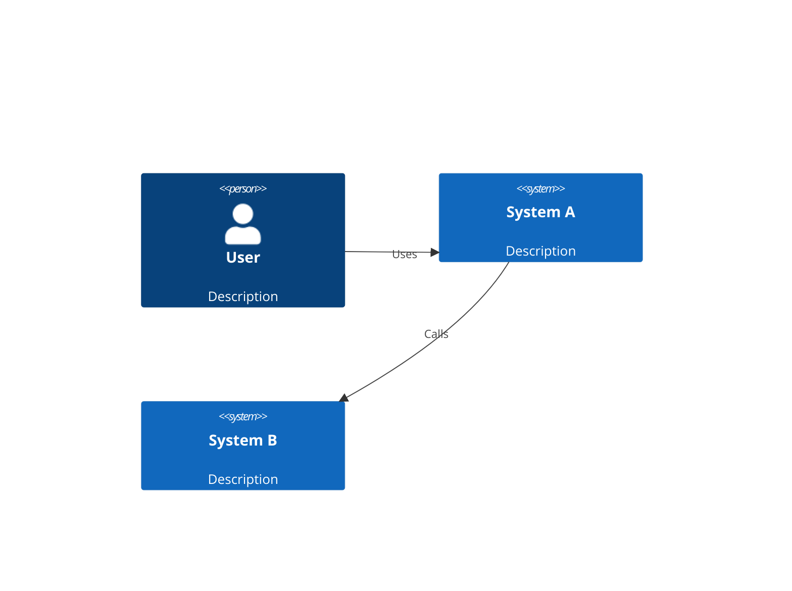

# C2Draw Initial Version Plan

## Overview

C2Draw is a cross-platform GUI application for creating C4 model diagrams (C1 System Context and C2 Container diagrams). It will provide an intuitive visual editor with export capabilities to C4-PlantUML and Mermaid formats.

## Technology Stack

| Component | Choice | Rationale |
|-----------|--------|-----------|
| UI Framework | egui + eframe | Immediate mode GUI, excellent for diagram editing, cross-platform (native + web), large ecosystem |
| Serialization | serde + serde_json | Standard Rust serialization, human-readable JSON format |
| Unique IDs | uuid | Standard UUID v4 for element identification |
| File Dialogs | rfd | Cross-platform native file dialogs |

## Architecture

```
c2draw/
├── Cargo.toml
└── src/
    ├── main.rs           # Application entry point
    ├── app.rs            # Main application state and UI
    ├── model/            # Data models
    │   ├── mod.rs        # Common types and traits
    │   ├── elements.rs   # Diagram elements (Person, System, Container)
    │   ├── diagram.rs    # Diagram container
    │   └── relationship.rs # Connections between elements
    ├── ui/               # UI components
    │   ├── mod.rs
    │   ├── canvas.rs     # Diagram canvas with drag-and-drop
    │   ├── sidebar.rs    # Element palette
    │   └── properties.rs # Element property editor
    └── export/           # Export formats
        ├── mod.rs
        ├── plantuml.rs   # C4-PlantUML generator
        └── mermaid.rs    # Mermaid diagram generator
```

## Data Model Design

### Core Types

```rust
// Element types for C4 model
enum ElementType {
    Person(PersonData),
    SoftwareSystem(SystemData),
    Container(ContainerData),
}

// C1: System Context level
struct PersonData {
    name: String,
    description: String,
    is_external: bool,  // External actor?
}

struct SystemData {
    name: String,
    description: String,
    is_external: bool,  // External system?
}

// C2: Container level
struct ContainerData {
    name: String,
    description: String,
    container_type: ContainerType,
    technology: String,
}

enum ContainerType {
    WebApplication,
    MobileApp,
    Database,
    Microservice,
    Queue,
    Other(String),
}

// Relationships between elements
struct Relationship {
    id: Uuid,
    source_id: Uuid,
    target_id: Uuid,
    description: String,
    technology: Option<String>,
}

// Complete diagram
struct Diagram {
    name: String,
    description: String,
    diagram_type: DiagramType,
    elements: HashMap<Uuid, Element>,
    relationships: Vec<Relationship>,
}

enum DiagramType {
    SystemContext,  // C1
    Container,      // C2
}

// Visual representation
struct Element {
    id: Uuid,
    element_type: ElementType,
    position: Vec2,     // Canvas position
    size: Vec2,         // Display size
}
```

## UI Design

### Main Window Layout

```
┌─────────────────────────────────────────────────────────┐
│ File  Edit  View  Export                                │  Menu Bar
├──────────┬──────────────────────────────┬───────────────┤
│          │                              │               │
│  PERSON  │                              │  Properties   │
│  ╔═══╗   │      ┌──────────┐           │  ───────────  │
│  ║ 👤 ║   │      │  System  │──────────▶│  Name: [___]  │
│  ╚═══╝   │      │   A      │           │  Desc: [___]  │
│          │      └──────────┘           │  Tech: [___]  │
│  SYSTEM  │            │                 │               │
│  ╔═══╗   │            │ Uses            │  [Delete]     │
│  ║ 🖥️ ║   │            ▼                 │               │
│  ╚═══╝   │      ┌──────────┐           │               │
│          │      │  System  │           │               │
│  CONTAINER│      │   B      │           │               │
│  ╔═══╗   │      └──────────┘           │               │
│  ║ 📦 ║   │                              │               │
│  ╚═══╝   │      [Diagram Canvas]        │               │
│          │                              │               │
├──────────┴──────────────────────────────┴───────────────┤
│ Status: Ready                                   v0.1.0  │
└─────────────────────────────────────────────────────────┘
```

### Features

1. **Sidebar Palette**
   - Drag elements onto canvas
   - Categorized by element type

2. **Canvas**
   - Drag-and-drop element positioning
   - Click to select elements
   - Drag to create relationships
   - Zoom and pan support

3. **Properties Panel**
   - Edit selected element properties
   - Delete elements
   - Change element type

4. **Menu Bar**
   - File: New, Open, Save, Save As
   - Edit: Undo, Redo, Delete
   - View: Zoom In/Out, Fit to Screen
   - Export: C4-PlantUML, Mermaid

## Export Formats

### C4-PlantUML

```plantuml
@startuml
!include https://raw.githubusercontent.com/plantuml-stdlib/C4-PlantUML/master/C4_Context.puml

Person(user, "User", "Description")
System(system_a, "System A", "Description")
System(system_b, "System B", "Description")

Rel(user, system_a, "Uses")
Rel(system_a, system_b, "Calls", "HTTPS")

@enduml
```

### Mermaid



## Implementation Phases

### Phase 1: Foundation
- [ ] Set up dependencies in Cargo.toml
- [ ] Create module structure
- [ ] Implement core data models

### Phase 2: Data Layer
- [ ] Implement all element types
- [ ] Implement diagram container
- [ ] Add serialization/deserialization

### Phase 3: Export
- [ ] Implement C4-PlantUML generator
- [ ] Implement Mermaid generator
- [ ] Add export UI

### Phase 4: UI
- [ ] Create basic egui app structure
- [ ] Implement sidebar palette
- [ ] Implement canvas with element rendering
- [ ] Add property editing panel

### Phase 5: Interactions
- [ ] Add drag-and-drop for elements
- [ ] Add relationship creation
- [ ] Add selection and property editing
- [ ] Implement file operations

### Phase 6: Polish
- [ ] Add example diagrams
- [ ] Write documentation
- [ ] Test exports with PlantUML/Mermaid

## Dependencies

```toml
[dependencies]
egui = "0.33"
eframe = { version = "0.33", features = ["default"] }
serde = { version = "1.0", features = ["derive"] }
serde_json = "1.0"
uuid = { version = "1.0", features = ["v4", "serde"] }
rfd = "0.15"
```

## File Format

Diagrams will be saved as JSON files with `.c4d` extension:

```json
{
  "version": "1.0",
  "name": "My System",
  "description": "System context diagram",
  "diagram_type": "SystemContext",
  "elements": [...],
  "relationships": [...]
}
```

## Next Steps

Ready to proceed with implementation. Switch to Code mode to begin Phase 1.
